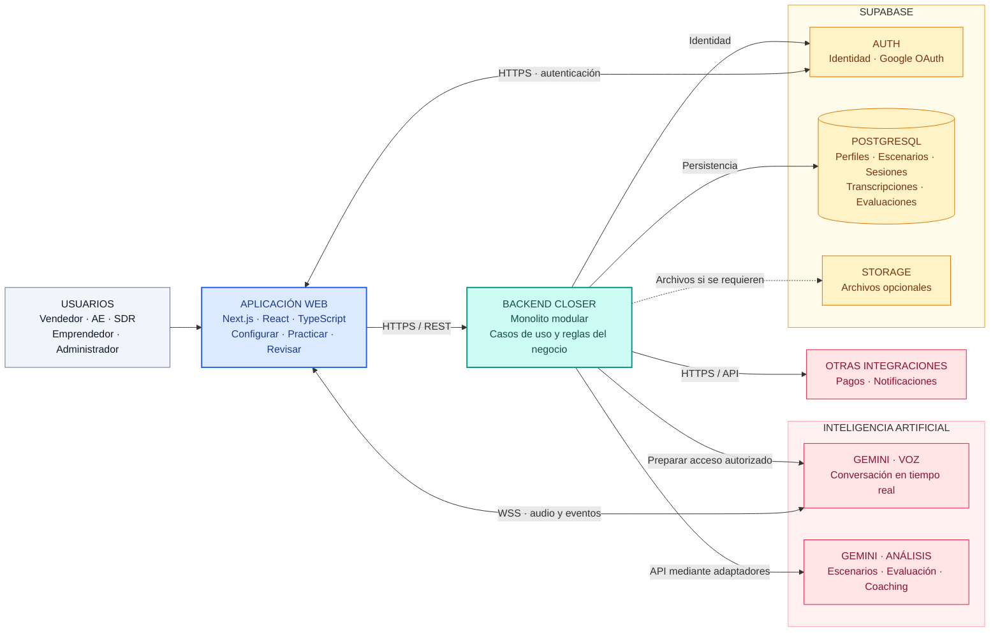

# Arquitectura inicial del sistema

Closer es una plataforma de entrenamiento comercial mediante simulaciones de voz con IA. Esta vista presenta los componentes principales y conecta con el **Entregable 03: estilo arquitectónico y enfoque arquitectónico**.

## Vista general

## Flujo principal

1. El usuario inicia sesión y configura su contexto comercial y el prospecto.
2. El backend verifica identidad y cuota, registra la sesión y prepara el acceso autorizado al servicio de voz.
3. La aplicación web intercambia audio y eventos con Gemini mediante WSS. Las credenciales permanentes se mantienen en el servidor; el mecanismo de acceso del navegador se verificará durante la implementación.
4. Al finalizar la práctica se conserva la sesión y su transcripción. El análisis posterior produce métricas y recomendaciones fuera del flujo interactivo de audio.
5. El usuario consulta sus resultados y evolución desde el historial.

## Alcance de los componentes

- **Aplicación web:** interfaz, micrófono, reproducción e indicadores de llamada.
- **Backend modular:** usuarios y perfiles, escenarios y prospectos, sesiones, evaluación, historial, planes y límites.
- **Supabase:** PostgreSQL para datos estructurados, Auth para identidad y Storage si se requieren archivos. Transcripciones, métricas y prospectos son datos, no servicios independientes.
- **Gemini:** capacidades externas de voz y análisis. Google GenAI SDK es una biblioteca de integración, no un servicio desplegado por separado.
- **Pagos y notificaciones:** proveedores externos accesibles mediante adaptadores.

Esta es una propuesta de diseño; los diagramas no representan una implementación desplegada. El rendimiento, la concurrencia y la disponibilidad requieren validación.

## Entregable 03

| Documento | Pregunta que responde |
|---|---|
| [Estilo arquitectónico](estilo-arquitectonico.md) | ¿Cómo se organiza y despliega el sistema? |
| [Enfoque arquitectónico](enfoque-arquitectonico.md) | ¿Cómo se separan responsabilidades y dependencias del código? |

Las decisiones se fundamentan en los [drivers arquitectónicos](../analisis-de-sistema/06-driver-arquitectonicos.md) y las [restricciones](../analisis-de-sistema/05-restricciones.md).
