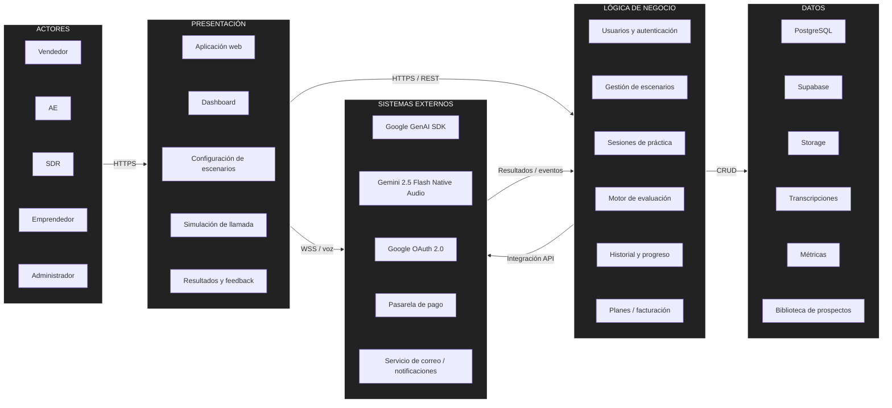

# Arquitectura inicial del sistema
## Diagrama de arquitectura

## Descripción
La arquitectura inicial de Closer se organiza en cuatro grupos principales:
- **Presentación:** permite que los usuarios configuren escenarios, inicien simulaciones y revisen sus resultados desde la aplicación web.
- **Lógica de negocio:** concentra la gestión de usuarios, escenarios, sesiones, evaluación, historial y planes de uso.
- **Datos:** almacena información de usuarios, prospectos, sesiones, transcripciones, métricas y recursos asociados.
- **Sistemas externos:** integra los servicios de Inteligencia Artificial, autenticación, pagos y notificaciones requeridos por la plataforma.

El flujo principal inicia cuando un usuario configura un escenario de práctica, continúa con una simulación de llamada por voz, procesa la conversación mediante los servicios de IA y finaliza almacenando métricas, transcripciones y recomendaciones para su posterior consulta.
