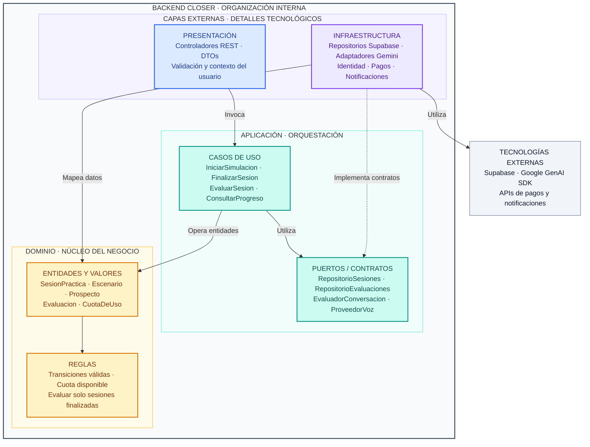
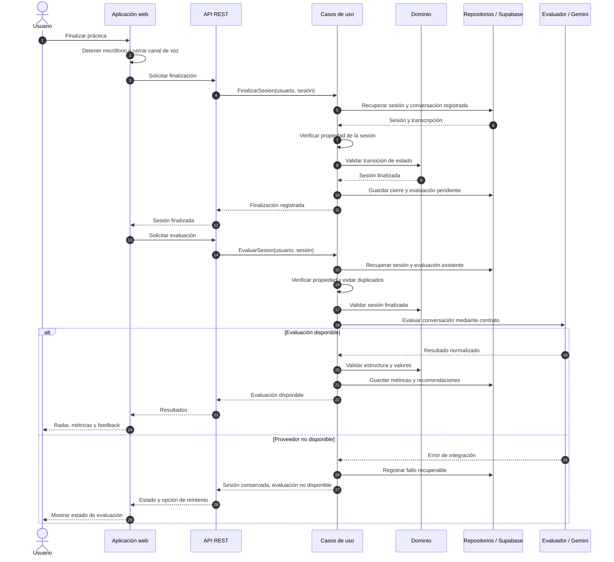

# Enfoque arquitectónico de Closer

**Enfoque seleccionado: Clean Architecture (Arquitectura Limpia).** Se aplica al backend modular para separar reglas y casos de uso de la presentación, la persistencia y los proveedores de IA.

El estilo describe módulos y despliegue; el enfoque define la organización del código y sus dependencias dentro de esos módulos.

## Diagrama de dependencias

**Lectura:** las flechas continuas representan dependencias de código y la discontinua, implementación de contratos. El dominio no depende de las capas externas. Los puertos están en aplicación porque expresan las necesidades de los casos de uso; infraestructura los implementa.

La composición del backend conecta contratos y adaptadores al iniciar la aplicación. Durante la ejecución, el caso de uso llama al adaptador mediante su contrato; su código no depende del cliente de Supabase ni del SDK de Google.

## Responsabilidades

| Capa | Aplicación en Closer | Límite |
|---|---|---|
| Presentación | Recibir solicitudes REST, validar formato y trasladar el contexto autenticado. | No calcular evaluaciones ni acceder directamente a tablas. |
| Aplicación | Coordinar prácticas, comprobar propiedad de recursos y solicitar evaluación y persistencia mediante puertos. | No importar SDKs de proveedores. |
| Dominio | Representar sesiones, escenarios y evaluaciones; controlar estados y reglas de cuotas. | No conocer HTTP, React ni almacenamiento. |
| Infraestructura | Implementar repositorios e integraciones de IA, identidad, pagos y notificaciones. | No decidir reglas comerciales. |

La aplicación web Next.js/React consume la API y gestiona la interacción y el audio. Este diagrama desarrolla la organización interna del backend. Las capas son separaciones lógicas, no despliegues independientes, y se aplican dentro de cada módulo.

## Ejemplo: finalizar y evaluar una sesión

Este diagrama representa ejecución, no dependencias de código. Repositorios y evaluador son adaptadores invocados a través de puertos. La transcripción se registra durante la práctica o al cerrarla. La evaluación ocurre después del cierre, separada del audio.

Ante un reintento, se reutiliza una evaluación completada. La coordinación de solicitudes simultáneas debe protegerse mediante persistencia transaccional para evitar duplicados. El ejemplo desarrolla el flujo autorizado; las solicitudes sin identidad válida, sin propiedad o con estados incompatibles se rechazan antes de modificar datos o invocar IA.

## Justificación

| Elemento | Aplicación a Closer |
|---|---|
| Problema resuelto | Evitar que cambios en Gemini o Supabase se propaguen a las reglas de sesiones, cuotas y evaluación. |
| DA06 · Mantenibilidad | Cambiar adaptadores conservando contratos y casos de uso cuando su comportamiento siga siendo compatible. |
| DA04 · Integración con IA | Encapsular solicitudes, respuestas y errores del proveedor. |
| DA03 · Seguridad | Comprobar propiedad y permisos en los casos de uso, complementando autenticación y RLS. |
| DA07 · Persistencia | Consultar y guardar mediante repositorios, sin clientes de base de datos en el dominio. |
| Beneficios | Probar reglas con implementaciones simuladas, localizar cambios técnicos y delimitar responsabilidades. |
| Compromisos | Introduce contratos y conversiones de datos; deben responder a necesidades reales. |

## Documentos relacionados

- [Estilo arquitectónico](estilo-arquitectonico.md)
- [Arquitectura inicial](arquitectura-inicial.md)
- [Drivers arquitectónicos](../analisis-de-sistema/06-driver-arquitectonicos.md)
