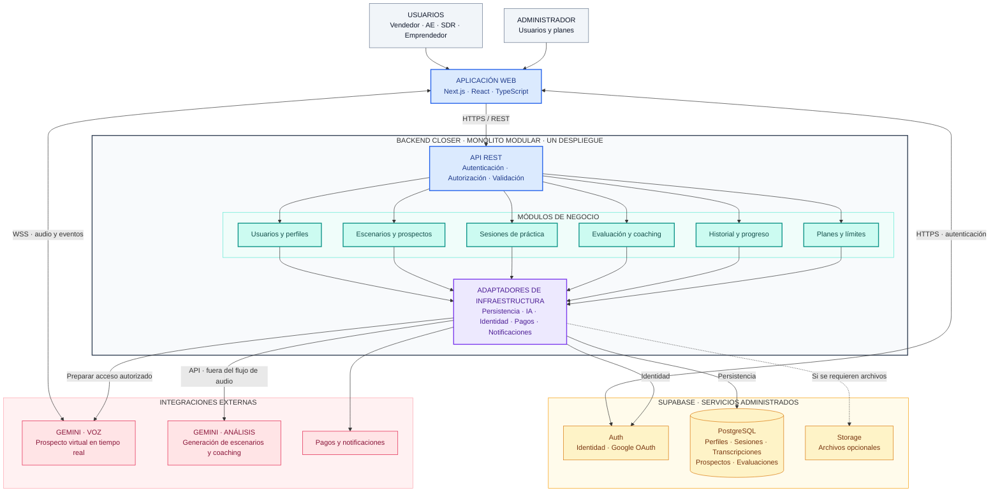

# Estilo arquitectónico de Closer

**Estilo seleccionado: monolito modular.** El backend se divide por responsabilidades de negocio y se despliega como una sola aplicación. La interfaz web y los proveedores administrados quedan fuera de ese límite.

## Diagrama del estilo

**Lectura:** azul = acceso; verde = negocio; violeta = adaptadores; ámbar = datos e identidad; rosa = proveedores. Las flechas indican comunicación, no dependencias de código. La línea discontinua representa almacenamiento opcional. Los bloques Gemini son capacidades externas, no microservicios propios.

## Módulos y responsabilidades

| Módulo | Responsabilidad | Requisitos |
|---|---|---|
| Usuarios y perfiles | Perfil comercial e identidad vinculada con Supabase Auth. | RF01–RF02 |
| Escenarios y prospectos | Producto, buyer persona, etapa y voz; generación y reutilización de perfiles. | RF03–RF06, RF15, RF17 |
| Sesiones de práctica | Inicio, estado, finalización y registro de la conversación. | RF07–RF09, RF14 |
| Evaluación y coaching | Métricas, competencias y recomendaciones posteriores. | RF10–RF13 |
| Historial y progreso | Consulta de resultados, evolución y eliminación de sesiones. | RF16–RF17 |
| Planes y límites | Cuotas y opciones de suscripción. | RF18 |

El soporte de RF19 se atiende mediante un caso de uso y el adaptador de notificaciones, sin exigir un módulo independiente.

## Reglas de organización

1. Los módulos comparten un despliegue y se comunican mediante contratos internos. Cada módulo controla sus datos; los demás consumen sus operaciones públicas.
2. El frontend gestiona micrófono, reproducción e indicadores. El backend verifica identidad, propiedad de recursos y cuota disponible.
3. La voz utiliza WSS con el proveedor y la gestión utiliza HTTPS/REST. El backend prepara el acceso autorizado; las credenciales permanentes permanecen en el servidor. El mecanismo concreto de acceso del navegador se verificará al implementar la integración.
4. La evaluación se ejecuta después del cierre de la conversación, fuera del flujo interactivo de audio. No se presupone un sistema de colas.
5. PostgreSQL está administrado por Supabase. Transcripciones y métricas son datos almacenados. La autorización se complementa con RLS cuando corresponda.

## Justificación y drivers

| Driver | Respuesta del diseño |
|---|---|
| DA01 · Baja latencia | Separar el streaming de voz de las operaciones de gestión y del análisis posterior. |
| DA02 · Concurrencia | Evitar retransmitir todo el audio por el backend; medir sesiones simultáneas, recursos y cuotas del proveedor. |
| DA03 · Seguridad | Verificar identidad, propiedad y cuotas; aplicar autorización y RLS. |
| DA04–DA05 · IA y comunicación | Adaptadores Google GenAI y separación entre WSS y HTTPS/REST. |
| DA06 · Mantenibilidad | Módulos con responsabilidades delimitadas e integraciones encapsuladas. |
| DA07 · Persistencia | PostgreSQL para información estructurada y Storage solo si se necesitan archivos. |

El monolito modular permite comenzar con una unidad de despliegue y una organización clara. Frente a microservicios, evita introducir inicialmente coordinación distribuida y despliegues independientes para cada módulo.

**Compromisos:** los módulos comparten recursos y despliegue; un fallo del backend puede afectar varias funciones. La disponibilidad también depende de los proveedores. La modularidad no garantiza rendimiento ni escalabilidad: se requieren mediciones.

## Documentos relacionados

- [Enfoque arquitectónico](enfoque-arquitectonico.md)
- [Arquitectura inicial](arquitectura-inicial.md)
- [Drivers arquitectónicos](../analisis-de-sistema/06-driver-arquitectonicos.md)
